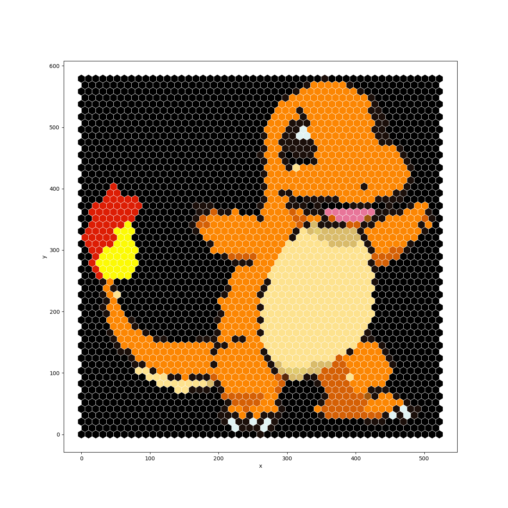

# Usage 
python hexbead.py -h

Note, the averaging modes are dictating the averaging mechanics used to create the "hexes".
Mode will tend to give better results than Median.

# Examples:
python hexbead.py --mode all --size 20 ..\HexGrid\charmander.png charhex.png

Will ouput the following images:

charhex_mode.png

charhex_median.png

python hexbead.py --mode all --size 50 ..\HexGrid\charmander.png charhex.png

charhex_mode.png

charhex_median.png
